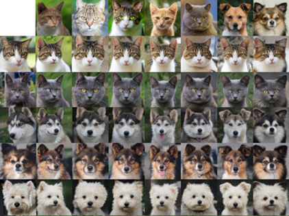
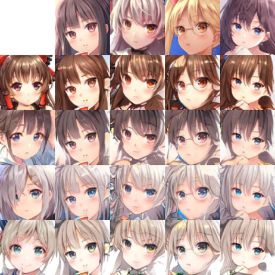

# 1122_０ss - 臉部影像特徵融合生成

## 功能說明
本項目旨在探索如何將人類、動物以及二次元角色的臉部特徵進行融合，並生成全新的臉部影像。

## 方法及程式架構
本系統主要由以下四部分組件構成：
1. **生成器 (Generator)**:
   - **ResNet U-Net**: 採用殘差網絡（ResNet）作為基礎架構的U-Net，適用於精確捕捉和融合不同來源的特徵。
   - **Swin Transformer Encoder**: 使用Swin Transformer作為編碼器，以其自注意力機制優化特徵提取。
   - **ResNet Decoder**: 利用ResNet架構進行解碼，將編碼後的特徵映射回圖像空間。
   - **Swin Transformer U-Net**: 結合Swin Transformer和U-Net的優點，用於更動態的特徵融合。

2. **風格編碼器 (Style Encoder)**:
   - **ResNet版本**: 使用殘差學習來穩定特徵提取，適合處理複雜的臉部特徵。
   - **Swin Transformer版本**: 利用Transformer的強大能力於特徵關聯性分析，提升風格捕捉的精準度。

3. **鑑別器 (Discriminator)**:
   - 統一採用ResNet架構，以其強大的特徵識別能力來評估生成圖像的真實性。

4. **映射網絡 (Mapping Network)**:
   - 採用簡單的線性組合方式，將風格編碼器輸出的風格向量有效映射至生成器，以此控制生成圖像的風格。


## 合成結果




## 程式開發及執行環境說明
### 系統環境
- **作業系統**: Ubuntu Linux 5.15.0-105-generic
- **編譯器**: gcc (Ubuntu 11.4.0-1ubuntu1~22.04) 11.4.0
- **連結器**: GNU ld (GNU Binutils for Ubuntu) 2.38

### 主要套件及其版本
- **PyTorch**: 1.13.1
- **CUDA Toolkit**: 版本 11.6.1
- **cuDNN**: 與PyTorch 1.13.1兼容的版本是 8.3.2
- **MKL (Math Kernel Library)**: 版本 2023.1.0
- **FFmpeg**: 版本 4.3
- **Torchvision**: 版本 0.14.1

### 安裝與執行步驟
1. **環境安裝**:
   - 使用 Anaconda 安裝預先配置的環境：`conda env create -f environment.yml`。

2. **數據集準備**:
   - 需要先準備數據集才能進行訓練。如果要使用指定的人臉數據集，可使用腳本 `bash download.sh [dataset name]` 下載。

3. **運行命令**:
   - `bash run_command [name]` 執行不同的訓練、評估或樣本生成模式。

### 執行結果
- 實驗展示不同模型與配置下的生成結果，如下所示：
  - **ResNet 10萬次迭代**
  - **嘗試替換Generator的encoder的Resnet為Swin transformer**
  - **加入cache 結構**
  - **使用Swin Transformer unet ，沒有學到特徵，推測是Swin Transformer太強，會將特徵洗掉**

### 有趣的實驗
- 人臉模型與動物臉融合生成
- 動物模型與人臉融合生成


## 項目結構
```bash
stargan-v2/
│
├── assets/                  # 包含用於文件或測試的靜態文件，如圖像
├── core/                    # 模型和實用程序的核心源代碼
│   ├── checkpoint.py        # 處理模型檢查點的保存和加載
│   ├── data_loader.py       # 加載訓練和測試數據的模塊
│   ├── model.py             # 定義模型架構Generator、Discriminator、Style Encoder、Mapping Network
│   ├── ms-swin_transformer.py  # microsoft Swin Transformer原碼
│   ├── solver.py            # 協調訓練和測試過程
│   ├── swin_transformerEncoder.py # Swin Transformer編碼器特定功能
│   ├── swin_transformer_unet.py   # Swin Transformer與U-Net架構的整合
│   ├── utils.py             # 項目中使用的公用工具（例如，圖像轉換）
│   ├── vis-swin_transformer.py   # torch vistion Swin Transformer 原碼
│   └── wing.py              # 與WING損失或相關功能的實現
│
├── download.sh              # 下載數據集或預訓獨模型的腳本
├── environment.yaml         # 用conda重現Python環境的YAML文件
├── expr/                    # 實驗目錄，通常用於輸出和日誌
│   ├── checkpoints/         # 在訓練期間存儲模型檢查點
│   ├── eval/                # 存儲評估結果和指標
│   ├── results/             # 存儲測試時的輸出圖像和視頻
│   └── samples/             # 快速測試的樣本輸出
│
├── log/                     # 訓練和評估的日誌文件
├── main.py                  # 主執行腳本，用於訓練、測試和評估
├── metrics/                 # 存儬衡量模型性能的腳本和工具
├── nohup.out                # 在後台運行進程的輸出日誌
├── README.md                # 包含安裝和使用說明的項目文件
├── run_commond.sh           # 一個運行特定命令或標誌的腳本，簡化如訓練會話或評估的常規操作
├── test/                    # 包含項目的測試腳本或測試案例
└── ui/                      # 用戶界面文件，若有的話（例如，用於演示應用）
